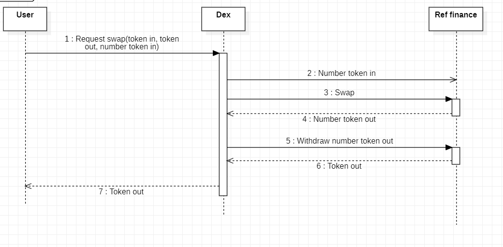
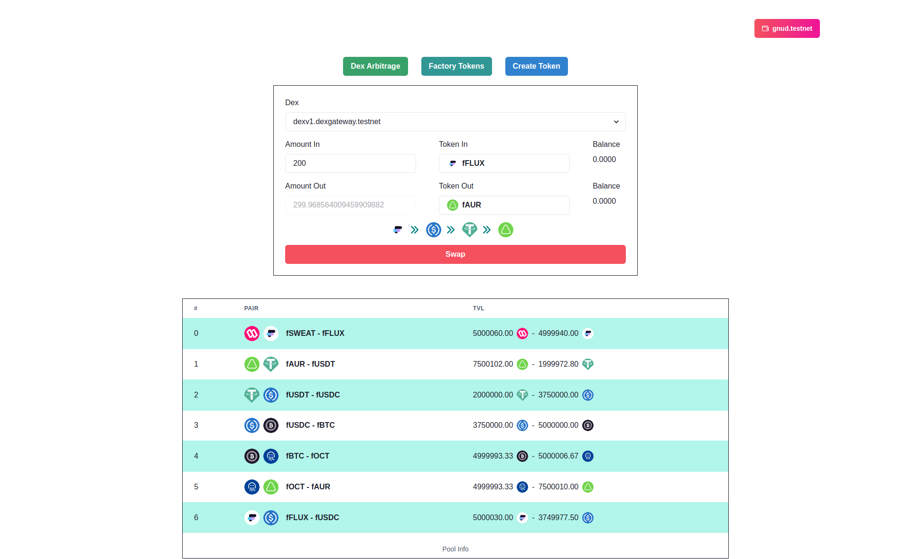

# near-arbitrage

# Intro

NEARbitrage is an arbitrage on NEAR Protocol. I use [ref.finance exchange contract](https://github.com/ref-finance/ref-contracts/blob/main/releases/ref_exchange_release.wasm) for base dex in arbitrage. With this project, you can swap through multiple dex on NEAR. It will increase your gas fee but your storage fee is too small. On frontend, currently I use simple routing for swap by BFS.

# App flow



# UI



# How to install

- Get [ref.finance exchange contract wasm](https://github.com/ref-finance/ref-contracts/blob/main/releases/ref_exchange_release.wasm)

- Deploy multiple dex contracts, multiple ft contracts, one arbitrage and one factory contract save it addresses and change into ```setup.md``` and ```ui/src/state/near.js``` file.

- You can run all commands on ```setup.md``` file or use old data I have deployed.

- ```cd ui && npm i && npm run dev``` to test application.
